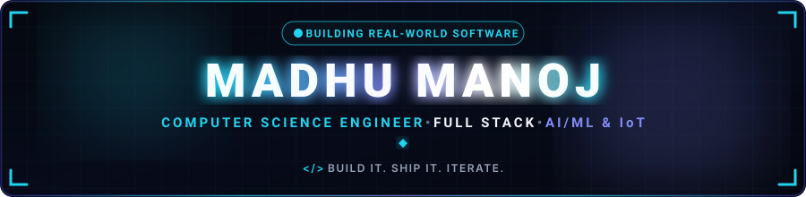
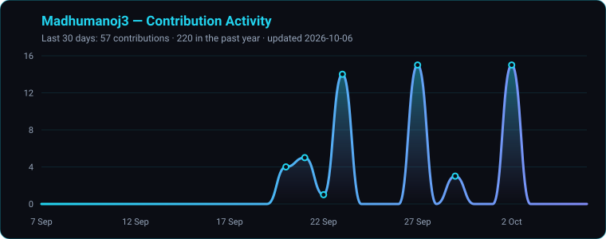
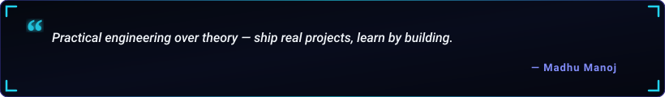

  

  

  
  &nbsp;
  
  &nbsp;
  
  &nbsp;
  

  

<h2 align="center">🧑‍💻 About Me</h2>

  

  

  Hey! I'm <b>Madhu Manoj</b>, a third-year <b>B.E. Computer Science and Engineering</b> student at <b>Mepco Schlenk Engineering College, Sivakasi</b> (Tamil Nadu, India). 
  I build full-stack web applications, develop AI/ML systems, and experiment with embedded hardware and IoT — then ship them as practical engineering prototypes.

  
  &nbsp;
  
  &nbsp;
  
  &nbsp;
  

<table width="100%" border="0" align="center">
<tr>
<td width="50%" align="center">
  <h4>🔭 Flagship Project</h4>
  
<b>SmartSense</b> Driver drowsiness prediction · SIH 2026

</td>
<td width="50%" align="center">
  <h4>🌱 Active Deep Dives</h4>
  
<b>FastAPI + React + TypeScript</b> Supabase · Computer Vision · ML

</td>
</tr>
<tr>
<td width="50%" align="center">
  <h4>🏆 Hackathons</h4>
  
<b>SIH · Robovanta · K.L.N.</b> Prototypes built under pressure

</td>
<td width="50%" align="center">
  <h4>🤝 Collaboration</h4>
  
<b>AI, Web &amp; IoT</b> Open to collaborations &amp; new challenges

</td>
</tr>
</table>

<h2 align="center">🚀 Featured Project Spotlight</h2>

<table width="100%" border="0" align="center">
<tr>
<td align="center">
  <h3>⭐ SmartSense — Predict. Rest. Recover.</h3>
  
<i>AI-based multimodal wearable for predictive driver drowsiness detection and intelligent alert/rest management — SIH 2026 (PS 26220).</i>

  

    An <b>ESP32</b> streams EEG/EOG from a <b>BioAmp EXG</b> sensor to a <b>React 18 + TypeScript + Vite</b> dashboard that computes a 0-100 vigilance score through a rule-based Rest Decision Engine and runs a six-stage safety loop:
     <b>DETECT → PREDICT → ALERT → REST → RECOVER → RESUME</b>
  

  

    GPS-based rest-stop recommendations (OpenStreetMap/Overpass, no API key) · route-corridor trip planning with arrival deadlines · EEG sleep-phase monitoring · smart alarm · exportable daily/weekly reports · Supabase multi-driver auth.
  

  

    
  

  

    
    
    
    
    
    
    
    
    
  

</td>
</tr>
</table>

<h2 align="center">📂 More Projects</h2>

<table width="100%" border="0" align="center">
<tr>
<td width="50%" valign="top">
  <h4>🛡️ Crime Intelligence &amp; Citizen Safety Platform</h4>
  
Django platform for complaint management and geospatial intelligence. Citizens file complaints with lat/long; police get dashboards, SOS alerts, missing-person and lost-and-found tracking. <b>scikit-learn</b> auto-prioritises complaints and <b>DBSCAN</b> (haversine) maps High/Medium/Low risk hotspots — no third-party map API.

  

    
    
    
    
  

</td>
<td width="50%" valign="top">
  <h4>🎓 Scholar Sarthi — Scholarship &amp; Counselling Aid</h4>
  
FastAPI + React + TypeScript platform (SIH 2026 prototype) for scholarship discovery, eligibility checks and step-by-step applications. A <b>PaddleOCR + LayoutLMv3</b> pipeline verifies documents and flags cross-document mismatches; a deterministic rule engine decides eligibility — AI assists, humans approve.

  

    
    
    
    
  

</td>
</tr>
<tr>
<td width="50%" valign="top">
  <h4>🧊 Industrial Refrigeration — HMI Simulation</h4>
  
Django-served BMS/HMI/SCADA operator screen simulating a refrigeration unit entirely client-side. State-derived sensor values, ten selectable faults and warnings, and a live inline-SVG machine mimic with refrigerant-flow animation that tapers off during compressor faults.

  

    
    
    
    
    
  

</td>
<td width="50%" valign="top">
  <h4>⌨️ Typing Performance Game</h4>
  
Browser-based typing practice and performance evaluation app built with vanilla web technologies.

  

    
    
    
  

</td>
</tr>
</table>

<h2 align="center">🧩 LeetCode Problem Solving</h2>

<i>Live tracker of coding challenges &amp; algorithmic problem-solving milestones.</i>

  

<h2 align="center">🛠️ Tech Stack &amp; Skills</h2>

<table>
<tr><td align="right" width="150"><b>Languages</b></td><td><table><tr><td align="center" width="90"> <b>Java</b></td><td align="center" width="90"> <b>Python</b></td><td align="center" width="90"> <b>C</b></td><td align="center" width="90"> <b>C++</b></td><td align="center" width="90"> <b>JavaScript</b></td><td align="center" width="90"> <b>TypeScript</b></td><td align="center" width="90"> <b>HTML</b></td><td align="center" width="90"> <b>CSS</b></td><td align="center" width="90"> <b>Dart</b></td></tr></table></td></tr>
<tr><td align="right" width="150"><b>Frontend &amp; Mobile</b></td><td><table><tr><td align="center" width="90"> <b>React</b></td><td align="center" width="90"> <b>Vite</b></td><td align="center" width="90"> <b>Tailwind</b></td><td align="center" width="90"> <b>Flutter</b></td></tr></table></td></tr>
<tr><td align="right" width="150"><b>Backend</b></td><td><table><tr><td align="center" width="90"> <b>Django</b></td><td align="center" width="90"> <b>FastAPI</b></td><td align="center" width="90"> <b>Node.js</b></td></tr></table></td></tr>
<tr><td align="right" width="150"><b>Databases</b></td><td><table><tr><td align="center" width="90"> <b>PostgreSQL</b></td><td align="center" width="90"> <b>Supabase</b></td><td align="center" width="90"> <b>SQLite</b></td><td align="center" width="90"> <b>MongoDB</b></td></tr></table></td></tr>
<tr><td align="right" width="150"><b>AI / ML</b></td><td><table><tr><td align="center" width="90"> <b>TensorFlow</b></td><td align="center" width="90"> <b>scikit-learn</b></td><td align="center" width="90"> <b>NumPy</b></td><td align="center" width="90"> <b>OpenCV</b></td></tr></table></td></tr>
<tr><td align="right" width="150"><b>Hardware & Tools</b></td><td><table><tr><td align="center" width="90"> <b>Arduino</b></td><td align="center" width="90"> <b>Git</b></td><td align="center" width="90"> <b>GitHub</b></td><td align="center" width="90"> <b>VS Code</b></td></tr></table></td></tr>
</table>

  
  
  
  

<h2 align="center">🏆 Achievements &amp; Activities</h2>

<table align="center">
<tr><td>🏅</td><td><b>Robovanta 24-Hour Hackathon</b> — Pixor Robotics Club</td></tr>
<tr><td>🎯</td><td><b>Inter-College Hackathon Participant</b> — K.L.N. College of Engineering</td></tr>
<tr><td>💡</td><td><b>SIH 2025 Internal Hackathon Participant</b></td></tr>
<tr><td>🎓</td><td><b>Full Stack Development Workshop</b> — GUVI &amp; HCL</td></tr>
<tr><td>🥈</td><td><b>IPL Auction Event Runner-Up</b> — Ramco Institute of Technology</td></tr>
<tr><td>📊</td><td><b>E-Summit'26 Biz Quiz Participant</b> — E-Cell, IIT Madras</td></tr>
<tr><td>🥋</td><td><b>Karate State-Level 1st Prize</b> · <b>Kata Winner</b></td></tr>
<tr><td>📜</td><td><b>8.5 CGPA</b> — Academic Achievement Certificate</td></tr>
</table>

<h2 align="center">📊 GitHub Analytics &amp; Activity</h2>

  
  &nbsp;&nbsp;
  

  

  

  

<h2 align="center">🔭 Currently Exploring</h2>

  Physiological signal processing for driver safety (EEG, EOG via BioAmp EXG) 
  Real-time inference on embedded hardware (ESP32) 
  Full-stack development with FastAPI + React + TypeScript + Supabase 
  Computer vision and document intelligence (OCR, LayoutLMv3) 
  Machine learning for public-safety and citizen-facing systems 
  Geospatial data analysis and location-based clustering

<h2 align="center">⚡ Contribution Journey</h2>

  

<h2 align="center">📬 Let's Connect &amp; Collaborate</h2>

<i>Whether it's AI, full-stack, embedded systems, or a hackathon idea — my inbox is always open!</i>

<table border="0" align="center">
<tr>
<td align="center" width="200">
  <a href="https://linkedin.com/in/madhumanoj" target="_blank">
    
      
    
  </a>
   
  <b>Professional Network</b>
</td>
<td align="center" width="200">
  <a href="https://leetcode.com/u/madhumanoj/" target="_blank">
    
      
    
  </a>
   
  <b>Problem Solving</b>
</td>
<td align="center" width="200">
  <a href="mailto:madhumanoj094@gmail.com">
    
      
    
  </a>
   
  <b>Direct Collaboration</b>
</td>
</tr>
</table>

  

